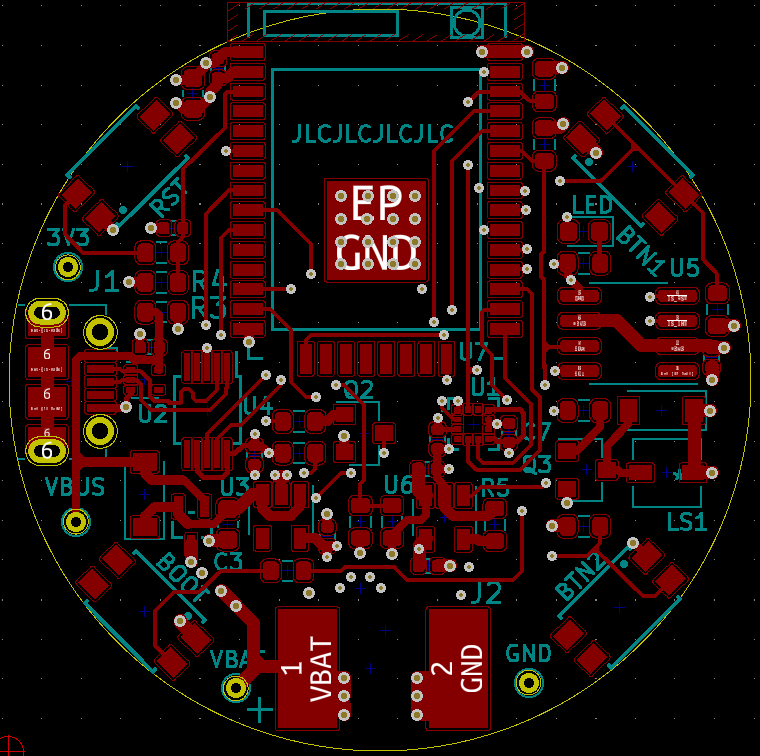
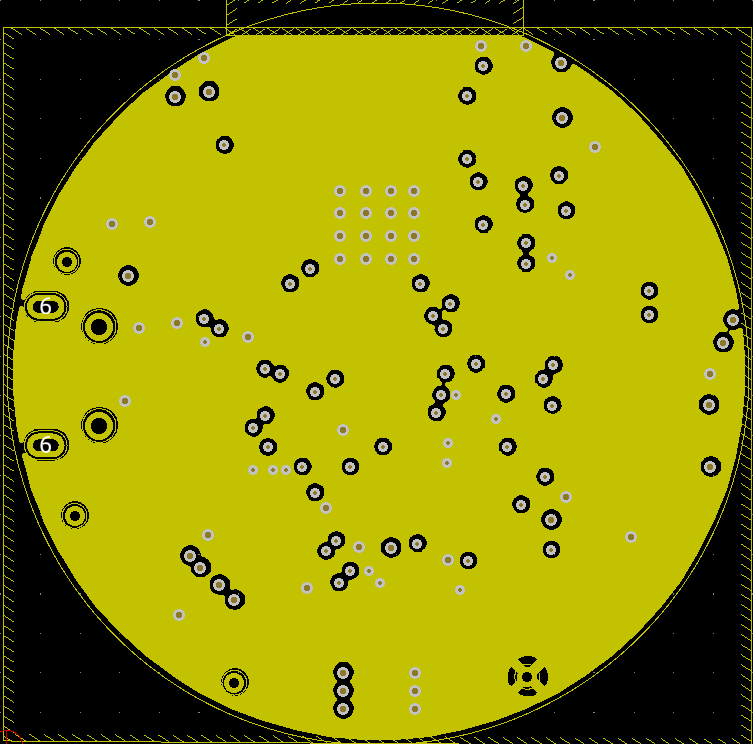

# Talha Smartwatch – ESP32 PCB Project

This is a custom smartwatch project built using the ESP32 module. I designed a custom PCB for it using KiCad, with the goal of creating a compact, wearable board that supports a display, power management, and wireless features. The board is meant to serve as the core of a basic smartwatch.

## Blinky Test

As a first test, I ran a basic blink sketch to make sure the board powered on correctly and the ESP32 was working. The onboard LED blinked successfully.

## Schematic

This is the full schematic I created in KiCad. It includes the ESP32-WROOM module, power regulation, crystal, buttons, and headers for display and battery.

## PCB Layer Views

The board is a 4-layer PCB. These are the individual layers exported from KiCad.

### All Layers (combined)

### Top Layer - Signal

### Inner Layer 1 - Ground

### Inner Layer 2 - VCC and Signal

### Bottom Layer - Signal

## Files in this Repository

- `esp32-smartwatch.kicad_sch` – KiCad schematic file  
- `esp32-smartwatch.kicad_pcb` – KiCad PCB layout  
- `bom.md` – Bill of Materials  
- `JOURNAL.md` – Build journal with progress logs  
- `README.md` – Project description (this file)  
- `images/` – All PCB and schematic images  

---

Designed and built for Hack Club Highway  
Project by Mohammed Talha

## Bill of Materials (BOM) – ESP32 Smartwatch

| Component                          | Qty | Unit Price (USD) | Total (USD) | Source & Link |
|-----------------------------------|:---:|:----------------:|:-----------:|:--------------|
| ESP32-WROVER-E Module             | 1   | $6.42            | $6.42       | [ESP32-WROVER-E – LCSC](https://www.lcsc.com/product-detail/WiFi-Modules_Espressif-Systems-ESP32-WROVER-E-N16R8_C529589.html) |
| 1.54" SPI Display (ST7789)        | 1   | $4.77            | $4.77       | [1.54" LCD – Waveshare](https://www.waveshare.com/wiki/1.54inch_LCD_Module) |
| TP4056 Type-C Charging Module     | 1   | $1.50            | $1.50       | [TP4056 – Cytron](https://my.cytron.io/p-lithium-battery-tp4056-1a-usb-c-charger-with-protection) |
| MT3608 Boost Converter            | 1   | $2.50            | $2.50       | [MT3608 – Amazon](https://www.amazon.com/dp/B07KJPRWD9) |
| 3.7V 1000mAh Li-Po Battery        | 1   | $7.00            | $7.00       | [LiPo Battery – Adafruit](https://www.adafruit.com/product/1578) |
| SMD Push Buttons                  | 2   | $0.10            | $0.20       | [Tactile Buttons – Amazon](https://www.amazon.in/dp/B084H8T7G7) |
| 32kHz Crystal Oscillator          | 1   | $0.50            | $0.50       | [32kHz Crystal – LCSC](https://www.lcsc.com/product-detail/Crystal-Resonators_HC-49S-32-768KHz_C9002.html) |
| SMD Resistors + Capacitor Kit     | –   | $3.00            | $3.00       | [SMD Kit – Amazon](https://www.amazon.com/dp/B07Q2P67VN) |
| Coin Vibration Motor              | 1   | $1.50            | $1.50       | [Vibration Motor – Adafruit](https://www.adafruit.com/product/1201) |
| USB-C Port (Connector only)       | 1   | $1.90            | $1.90       | [USB-C Connector – LCSC](https://www.lcsc.com/product-detail/USB-Connectors_UJU-MH-TYPE-C-16P_C165948.html) |
| Custom 4-layer PCB + Assembly     | –   | $45.00           | $45.00      | [JLCPCB](https://jlcpcb.com) |
| Watch Strap (22mm nylon/silicone) | –   | $10.00           | $10.00      | [Watch Strap – Amazon](https://www.amazon.in/s?k=watch+strap+22mm) |
| 3D Printed Enclosure              | –   | $25.00           | $25.00      | [PCBWay Case](https://www.pcbway.com/project/shareproject/) or local print |
| Misc (headers, wires, solder)     | –   | $5.00            | $5.00       | Local stores |
| Shipping & Buffer                 | –   | $10.00           | $10.00      | Estimate |

**Total Estimated Cost: $124.29**

